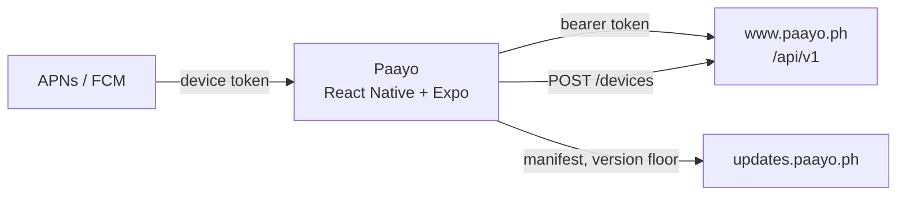
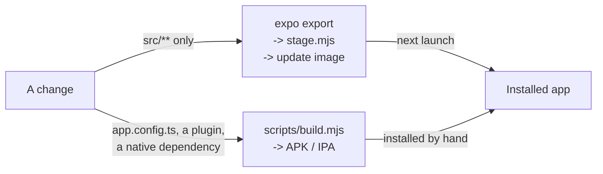

# Paayo Mobile

Cross-platform client for the Paayo field-service platform — **React Native +
Expo**, one TypeScript codebase for Android and iOS.

It talks to the [server](../server)'s token API at `/api/v1`. The server's
console is administrators-only, so this app is how ordinary people — clients and
providers both — actually reach the platform.

Native `android/` and `ios/` are **generated** from `app.config.ts` by
`expo prebuild` and are not committed. Treat them as build output: never edit
them, and delete them freely.

## Branches

| Branch | What it is |
| --- | --- |
| `master` | this app — React Native + Expo, both platforms |
| `android` | the retired native Android foundation (Kotlin + Compose), kept for reference |

`master` shares no history with `android`. The Kotlin foundation targeted a
different backend and its networking layer (Retrofit) is JVM-only, so it could
never have reached iOS.

---

## Architecture

### What it talks to



One `request()` in `src/lib/api.ts` over `fetch` — an `XMLHttpRequest` path
exists only because uploads need progress. The token lives in
`expo-secure-store` under `paayo.token` (`src/lib/tokens.ts`) and everything
above it is React context: `src/lib/session.tsx` holds the signed-in user,
`workspace.tsx` the provider being acted for. There is no Redux, no Zustand and
no React Query; the server is the state, and a screen asks for what it needs.

The push token comes from APNs or FCM **directly** —
`getDevicePushTokenAsync()`, not Expo's push service — and is handed to the
server at `POST /devices`, which is also what gets deleted on sign-out.

### Over-the-air updates

The app ships its own updates. There is **no EAS** here: no `eas.json`, no
project id, no channels. `app.config.ts` points `expo-updates` at
`https://updates.paayo.ph`, which is the small Go server in
[`server/`](server/README.md) — bundles baked into an image, deployed by pushing
a tag.



Which branch a change takes is not a judgement call, because
`runtimeVersion: { policy: 'fingerprint' }` decides it. The fingerprint hashes
the native inputs, and an install accepts **only** a manifest whose
`runtimeVersion` equals its own. So:

| Changed | Fingerprint | Reaches a phone by |
| --- | --- | --- |
| anything under `src/`, `assets/` | unchanged | OTA, on next launch |
| `app.config.ts`, a config plugin, a native dependency | moves | a new build — [§5](#5-building) |

Two consequences fall straight out of that rule, and both are the update
server's problem rather than the app's:

- **Old fingerprints have to be kept.** An image holding only the newest one
  leaves every phone on an older native build with `noUpdateAvailable` forever,
  which is indistinguishable from being up to date. `server/bundles/` carries
  earlier exports forward.
- **So there is a floor.** `server/minimum.json` answers
  `GET /minimum?platform=…` with the lowest version still allowed;
  `useVersionFloor()` in `src/lib/updates.ts` checks it on resume and
  `UpdateGate` blocks the app below it. A phone that cannot reach the host is
  deliberately left alone — an unanswered request is a network problem, and
  locking someone out over one is worse than serving a version we would rather
  retire.

Manifests are RSA-SHA256 code-signed. The certificate in `certs/` is compiled
into the binary and the private key lives only on the update host, so an
unsigned manifest is refused before a single asset is fetched.

### One coupling worth naming

The palette, the service icons and the wordmark are **generated from the
server**, not written here, so the two clients cannot drift apart. That is an
architectural dependency on `../server` at build time, and it is why several
files under `src/` must never be hand-edited — see
[Generated files](#generated-files).

---

## 2. Prerequisites

```sh
brew install node cocoapods
brew install --cask temurin@21 android-studio
```

Plus **Xcode** from the App Store, and the **Android SDK 36** from Android
Studio's SDK Manager on first launch.

Two things about the JDK, both of which will cost you an afternoon otherwise:

- **JDK 17 or 21 — never 25.** [JEP 472](https://openjdk.org/jeps/472) made
  restricted JNI access fatal, which kills the CMake step React Native's native
  modules go through. The failure reads like a code fault. `npm run android`
  resolves a supported JDK itself and refuses to start when it cannot find one.
- **Install it as a cask, never `brew install openjdk@21`.** The formula is
  keg-only, so macOS never registers it and nothing finds it without setting
  `JAVA_HOME` by hand.

No Apple Developer account is needed for simulator builds, and none is needed
for Android at all.

## 3. Setup

```sh
npm install
cp .env.example .env
```

`.env.example` explains each key inline. Most can stay empty — the app runs
against a local server with none of them filled. What you probably want:

| Key | When you need it |
| --- | --- |
| `EXPO_PUBLIC_API_URL` | only for a **physical device** — see [Reaching the server](#reaching-the-server) |
| `EXPO_PUBLIC_GOOGLE_*_CLIENT_ID` | Google sign-in |
| `EXPO_PUBLIC_MICROSOFT_CLIENT_ID` | Microsoft sign-in |
| `GOOGLE_MAPS_API_KEY` | the map on Android (iOS uses Apple Maps, no key) |
| `APPLE_TEAM_ID` | only to sign a release IPA |
| `EXPO_PUBLIC_APPLE_DEVELOPER_PROGRAM` | leave empty — see below |
| `EXPO_PUBLIC_PASSKEY_DOMAIN` | leave empty locally; production sets it |

`EXPO_PUBLIC_*` values are **inlined by Babel as the bundle is written**, not
read at runtime. Changing one needs a bundler restart — a reload will not do it
— and changing one that feeds `app.config.ts` (`GOOGLE_MAPS_API_KEY`, the two
above) needs `npm run prebuild` and a rebuild.

### The one Apple flag

`EXPO_PUBLIC_APPLE_DEVELOPER_PROGRAM` answers a single question: **was this
build signed by a paid Apple account?**

It is one flag rather than one per feature because it is one fact about the
world. Several Apple capabilities cost money — Associated Domains, which
passkeys need, and Push Notifications so far — and a free Personal Team can hold
none of them. Asking for one it cannot hold does not disable that feature: Xcode
refuses to sign and **the whole app stops building**.

Empty is the safe answer, and the current one. iOS builds and installs as
normal, with passkeys and push skipped. Android never reads it at all. The day
you
enrol, set it to anything and both turn on with no code change — it is native
configuration, so `npm run prebuild` and a rebuild, not a reload.

`EXPO_PUBLIC_PASSKEY_DOMAIN` is the separate half: *which* domain passkeys bind
to. Both platforms fetch a file from it over HTTPS first, so an IP or
`localhost` can never work — passkeys are a production-build feature, and
`scripts/build.mjs` sets it for you. Today that means **Android passkeys on, iOS
off**, which is exactly what the two flags are shaped to express.

### Firebase — Android push

Android push registers against a Firebase project, and reads the sender id out
of a config file rather than an env var.

Firebase console → project **paayo-ph** → *Add app* → Android, package
`com.paayo.ph` → download `google-services.json` into this directory. It is
gitignored. iOS push goes to APNs directly and needs no plist.

### Google sign-in

Three OAuth client ids — Android, iOS, Web — from one project in the Google
Cloud console. They must be the same three the server lists in
`services.google.audiences`, or it will refuse the token they mint.

### Maps

`GOOGLE_MAPS_API_KEY`, Android only. Restrict it to Android apps, this package
and the signing SHA-1, with nothing enabled on it but **Maps SDK for Android**.
Cost is nothing — the native map draws an unmetered SKU.

## 4. Running

```sh
npm run android            # emulator, or the attached device if there is one
npm run android:device     # pick a physical device
npm run ios                # simulator
npm run ios:device         # pick a physical device
npm start                  # bundler only, against an already-installed build
```

Extra arguments pass straight through: `npm run android -- -d Pixel_9`.

To check a **release** bundle on a device without producing a file —
minified, no dev menu, the production React build:

```sh
npm run android:release
npm run ios:release
```

### Reaching the server

Start the server with `composer dev`; it binds `0.0.0.0` already.

| Running on | What to do |
| --- | --- |
| Android emulator | nothing. Resolves the host as `10.0.2.2:44080` on its own. |
| iOS simulator | nothing. `localhost:44080` is the host. |
| **Android over USB** | `npm run android:reverse`, then set `EXPO_PUBLIC_API_URL=http://localhost:44080` |
| **Any device over Wi-Fi** | set `EXPO_PUBLIC_API_URL=http://<your-lan-ip>:44080` |

`android:reverse` runs `adb reverse tcp:44080 tcp:44080`, which tunnels the
phone's `localhost:44080` back to yours over the cable. It is the easiest of the
four — no IP to look up, and nothing for a firewall to block.

The first two rows say "nothing" only while `EXPO_PUBLIC_API_URL` is **empty**.
Set once for a device and left there, it overrides the emulator's and
simulator's own defaults too, and they will then fail to reach anything.

Over Wi-Fi, two things bite. macOS must not have **Block all incoming
connections** on: it overrides per-app allowances, so permitting `node` does
nothing while it is set. And the server's `AWS_ENDPOINT` must carry the same LAN
address, or the app will authenticate fine and then show no images.

## 5. Building

```sh
npm run build              # both platforms, pointed at production
npm run build:android      # APK
npm run build:ios          # IPA
npm run build:local        # both, pointed at this machine
```

Artifacts land in `build/` as `paayo-<version>-<target>.{apk,ipa}`.

Where the build points is chosen explicitly and **printed before it starts**,
because the URL is baked into the binary and a mis-pointed build looks identical
to a correct one until it is installed:

| Flag | Server |
| --- | --- |
| *(default)* | the `PRODUCTION` block in `scripts/build.mjs` — `https://www.paayo.ph` |
| `--local` | `EXPO_PUBLIC_API_URL` from `.env`, or this machine's LAN address |
| `--api-url <url>` | exactly that |

So `npm run build:android -- --api-url http://10.0.0.5:44080` builds an APK
against one particular server, and `npm run build:ios -- --local` builds an IPA
against your laptop. `--no-prebuild` keeps `android/` and `ios/` as they are;
otherwise they are regenerated when missing.

`--dry-run` prints what a build would be and stops, which is the quick way to
check you are about to build the right thing:

```
$ npm run build -- --dry-run

  Building  android + ios 1.0.0 (production)
  Server    https://www.paayo.ph
  PASSKEY_DOMAIN  www.paayo.ph
```

Everything the release build changes is listed, so one that has passkeys quietly
switched off shows it here rather than on the phone.

Those values live in a `PRODUCTION` block at the top of `scripts/build.mjs` —
not a `.env.production`. A file named like a secrets file, carved out of the
`.env*` gitignore rule so it could be shared, is a trap for whoever adds the
next value. A public URL and a public domain belong in code. Every key it lists
is set explicitly on every build, so a `--local` build cannot inherit a
production setting.

The APK carries all four ABIs and is not minified, so it comes out around
110 MB. That is expected for something you install by hand — a Play upload
would be an `.aab`, which splits it per device.

### What the signing situation actually is

**Android.** The release APK is signed with the **stock React Native debug
keystore**, and that is currently correct rather than an oversight — the
server's `PASSKEY_ANDROID_ORIGIN` and its `resources/well-known/assetlinks.json`
both carry that key's fingerprint, so it is the only signature passkeys accept
today. Shipping to Play means all three change together: generate a keystore,
wire it into `android/app/build.gradle`, then regenerate `assetlinks.json` and
`PASSKEY_ANDROID_ORIGIN` from the new fingerprint.

**iOS.** With `APPLE_TEAM_ID` set, the IPA is archived and exported signed for
development. Without it — the normal case, since signing needs a paid Apple
Developer Program membership — the archive is made unsigned and packaged by
hand. That IPA will not install directly; it is the input a sideloader
(AltStore, Sideloadly) re-signs with your own Apple ID.

A free Personal Team signs for **7 days**. When a build that worked yesterday
refuses to launch, re-run `npm run ios:device`; nothing is wrong.

## 6. Maintenance

```sh
npm run ci              # lint, types, tests — what to run before pushing
npm test                # jest
npm run types:check     # tsc --noEmit
npm run lint            # eslint --fix

npm run doctor          # expo-doctor
npm run deps:check      # are dependency versions what this SDK expects?
npm run deps:fix        # make them so — never hand-edit version ranges
npm run prebuild        # regenerate android/ and ios/
npm run clean           # delete android/, ios/, build/, and the caches
```

`deps:check` and `deps:fix` are not optional politeness. Hand-picked versions
drift from what the Expo SDK expects, and the results are strange:
`react-native-svg@15.13` imported Node's `buffer` and broke the whole bundle,
where the SDK's own 15.15.4 does not.

### Generated files

The palette, the icon map and the logo are **generated from the console** so the
two clients cannot drift apart. Never hand-edit `src/global.css`,
`src/theme/colors.js`, `src/theme/palette.js`, `src/lib/icons.ts` or
`src/lib/logo.ts`:

```sh
npm run sync            # all three
npm run sync:tokens     # colours, from ../server/resources/css/app.css
npm run sync:icons      # service icons, from the server's catalogue
npm run sync:logo       # the wordmark, from assets/images/paayo-logo.svg
npm run icons:render    # rasterise the app icons (needs a prebuild after)
```

The colour sync exists because the console states its palette in `oklch`, which
React Native cannot parse.

## Layout

```
src/app/          expo-router; (auth) signed out, (app) signed in
src/components/   ui/ primitives, hand-written
src/lib/          api client, session, secure token store, types
src/theme/        generated colour map — do not edit
assets/           embedded fonts and app icons
types/            ambient declarations
scripts/          build, JDK preflight, codegen, iOS config plugins
__mocks__/        native module stubs for jest
.ai/rules/        conventions; read before editing
```

## Before you change the build

**`.ai/rules/toolchain.md` is the source of truth**, and it is there because
each entry cost someone a day. It covers why `expo run:android` must not be
called directly, why the iOS development team must *not* be pinned in
`app.config.ts`, why Xcode's "update to recommended settings" breaks device
builds only, the iOS 27 scene-lifecycle patch we carry ourselves, why
`expo-notifications` has its own entitlement stripped back out, and why the two
`scheme` entries are both load-bearing.

```sh
grep -rin 'entitlement' .ai/rules
```
